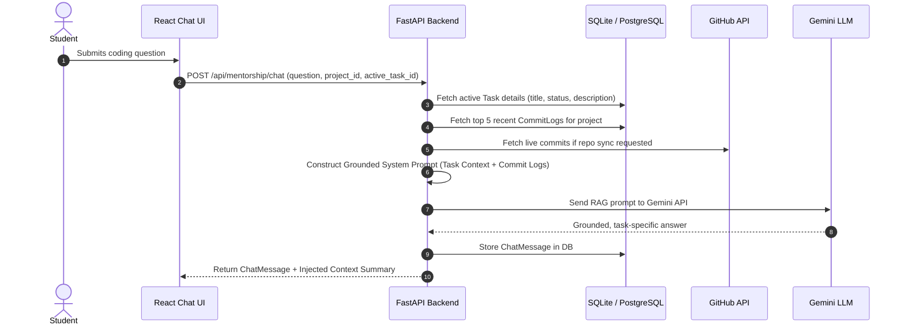

# AI Guided Academic Project Progress Tracking & Mentorship Platform

> **Infosys Springboard Internship Project**  
> A 3-pillar AI co-pilot platform designed to transform academic project visibility for student teams and faculty mentors through automated Agile roadmap planning, real-time GitHub commit progress tracking, and context-injected AI mentorship.

---

## 🌟 Key Features

### 1. 🎯 AI Project Planner
- Takes raw student project ideas and converts them into structured Agile roadmaps (epics, tasks, sprints).
- Enforces strict JSON Schema validation using Pydantic output parsers with automatic retry logic on malformed LLM responses.

### 2. 📊 Dual Interactive Dashboards & GitHub Tracking Engine
- **Student Workspace**: Interactive Kanban board (To Do, In Progress, In Review, Completed), sprint filters, and task management.
- **GitHub Commit Auto-Tracking**: Fetches commit logs from connected student GitHub repositories, matches commit messages and git branches to Kanban tasks, and auto-updates task states.
- **Faculty Mentor Oversight**: High-level health metrics across all assigned student teams, sprint velocity indicators, and automated **"AT RISK"** flags for teams with inactive commit logs or delayed tasks.

### 3. 🤖 Context-Aware RAG AI Mentorship Assistant
- **Strict Hard AI Constraint**: **Zero fine-tuning**. All AI assistance is powered purely via Prompt Engineering + Context Injection + RAG.
- When a student asks a technical query, the backend executes a 5-step pipeline:
  1. Retrieves active Kanban task details (title, description, status, git branch).
  2. Fetches top 3-5 latest GitHub commits & diff summaries for the project.
  3. Ingests project tech stack metadata.
  4. Injects context into a grounded system prompt.
  5. Queries Gemini LLM and returns a grounded answer.

---

## 🏗️ Tech Stack & Architecture

- **Frontend**: React 18, Vite, Tailwind CSS, Lucide Icons, React Router DOM, Axios.
- **Backend**: Python 3.10+, FastAPI, Async SQLAlchemy 2.0, AsyncSQLite (switchable to PostgreSQL via `DATABASE_URL`), Pydantic v2, PyJWT.
- **LLM Layer**: Gemini API (`google-genai` REST integration) + Pluggable `BaseLLMProvider` interface (supporting Gemini, OpenAI, and Mock fallbacks).
- **Integrations**: GitHub REST API for repository commit log ingestion.

---

## 📁 Repository Structure

```
├── backend/
│   ├── app/
│   │   ├── api/          # FastAPI Routers (auth, projects, tasks, planner, github, mentorship)
│   │   ├── core/         # Settings & JWT security
│   │   ├── db/           # Async SQLAlchemy session engine & base models
│   │   ├── models/       # SQL Models (User, Project, Task, CommitLog, ChatMessage)
│   │   ├── schemas/      # Pydantic validation & strict LLM JSON schemas
│   │   ├── services/     # LLM service, GitHub sync engine, RAG mentorship pipeline
│   │   ├── main.py       # Main FastAPI app & lifespan DB auto-creation
│   │   └── seed.py       # Database seeder with realistic student/mentor dummy data
│   ├── tests/            # Pytest test suite
│   └── requirements.txt  # Python backend dependencies
├── frontend/
│   ├── src/
│   │   ├── components/   # Navbar, Sidebar, KanbanBoard, MentorshipChat, AIPlannerModal, GitHubCommitFeed
│   │   ├── context/      # React AuthContext
│   │   ├── pages/        # Login, Register, StudentDashboard, MentorDashboard
│   │   ├── services/     # Axios API client with JWT interceptor
│   │   ├── App.jsx       # Routing & Protected routes
│   │   └── main.jsx
│   ├── package.json
│   └── vite.config.js
├── .env.example
└── README.md
```

---

## 🚀 Quickstart & Setup Guide

### Prerequisites
- Python 3.10 or higher
- Node.js 18 or higher
- npm or yarn

### 1. Backend Setup
```bash
# Navigate to backend directory
cd backend

# Create virtual environment
python -m venv .venv
source .venv/bin/activate  # On Windows: .venv\Scripts\activate

# Install dependencies
pip install -r requirements.txt

# Run Database Seed Script (Pre-populates sample students, mentors, tasks & commits)
python app/seed.py

# Launch FastAPI Backend Server
uvicorn app.main:app --reload --port 8000
```
- API Swagger Docs available at: `http://localhost:8000/docs`

### 2. Frontend Setup
```bash
# Open a new terminal and navigate to frontend directory
cd frontend

# Install Node dependencies
npm install

# Launch React Dev Server
npm run dev
```
- Application UI available at: `http://localhost:5173`

---

## 🔐 Demo Credentials

| Role | Email | Password | Access / Features |
| :--- | :--- | :--- | :--- |
| **Student** | `student@univ.edu` | `student123` | Student Workspace, AI Project Planner, Kanban Board, Mentorship Chat |
| **Mentor** | `mentor@univ.edu` | `mentor123` | Faculty Oversight Center, Risk Indicators, Team Activity Log Inspection |

---

## 🧪 Running Automated Tests

```bash
cd backend
pytest tests/
```

---

## 🧠 RAG & Context Injection Pipeline Detail


